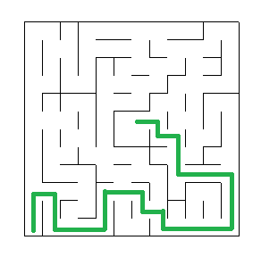

# Robot Motion Planning: Plot and Navigate a Virtual Maze

## Project description
I've completed this as my graduation project from Udacity Data Science Nanodegree. 

The project solves [Micromouse](https://en.wikipedia.org/wiki/Micromouse) competition, wherein a robot mouse is tasked with plotting a path from a corner of the maze to its center.
- A simulated robot mouse is placed in the maze corner with the goal to **find the shortest path to the maze's center**. The robot has three (the front, left and the right) obstacle sensors detecting the number of open squares in the direction of the sensor. 
- In the first run, the robot mouse tries to map out the maze to not only find the center, but also figure out the best paths to the center. In subsequent run, the robot mouse attempts to reach the center in the fastest time possible, using what it has previously learned.

- First, I've implemented simple `wall foolower algorithm` to see whether it can handle the task.
As the maze is not simple connected, the `wall follower` ended running in circles and the need for a better algorithm arised.
- In the next step, I've implemented visualisation of the robot movement in maze by `turtle library` to see how algorithm is performing.
- Then I've implemented the Trémaux's algorithm which sucessfully handle the maze
- Lastly, I've extended visualisation of the robot movement to export robot movement into a GIF for future analysis and results sharing.

The code is modular and commmented, so you can easily add an algorithm of your own and try to get the robot from the maze.

For more details about the project you can check [The Project Blog Post](https://jmarcan.github.io/jekyll/update/2019/12/16/Robot-Motion-Planning.html)

## Usage
1. Execute the file `Code\run.py` with the corresponding maze
`python run.py test_maze_01.txt`
- `test_maze_01.txt` represents the maze configuration. The repo is provided with three prepared options

The AI algorithm will explore and map the maze, then find the shortest path, then use the shortest path to race to the destination. 

2. Execute the file `Code\showmaze.py`to visualize the robot movement in the maze
`python showmaze.py robot_path.json`

## Libraries used
Python 3
- numpy
- turtle
- json

## Files in the repository
- `Code\robot.py`: The file contains my implementation of AI algorithm to explore and map the maze,
then find the shortest path, then use the shortest path to race to the destination. 
The path travelled by the robot is logged into a log file `robot_path.json`,
so robot behaviour inside the maze can be later visualized by the code `showmaze.py`.
- `Code\showmaze.py`: Contains the code to visualize selected maze with the robot movement
- `Code\run.py`: 'Tester code to evaluate implementation of robot algorithm and display the results
