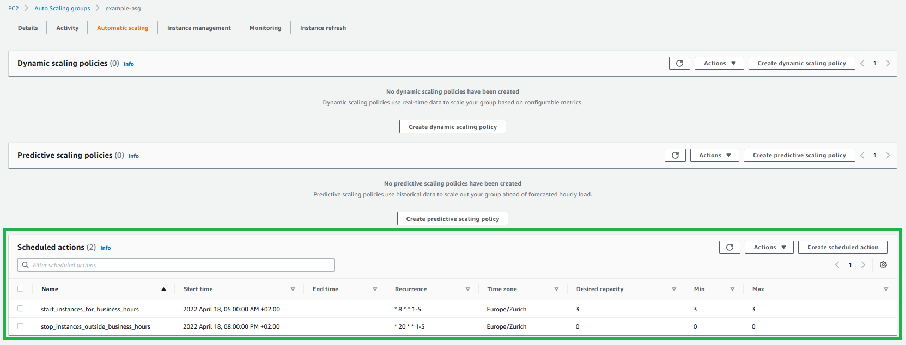

# Optimizing costs by running infrastructure only during business hours

Not all applications need to run 24/7.<br>
You will get 55% savings by running infrastructure from 5am till 20pm during weekdays instead of 24/7.<br>
We will look here how to configure cloud servers to run only during business hours.

## Numbers behind
When you run infrastructure 24/7, your servers consume resources 168h/week<br>
When you run infrastructure only in business hours, let's say from 5am till 20pm during weekdays, your servers consume only 75h/week (15h*5days)<br>
That's 55% savings in comparison with running it 24/7.<br>
Good for your wallet. Good for the nature.

## What applications can benefit
Except, internal applications that are accessed only during business hours<br> 
typical use-case are non-productive environments, that engineering team usually needs only during business hours.<br>
For sure, if your infrastructure is serverless, then good for you for you don't have to worry about your servers run time.

## How it relates to capacity reservations savings
Running infrastruce only during business hours is alternative to server capacity reservations.<br>
In server capacity reservation you can do long-term order of specific servers and get discount for it in return.<br>
Depending on discount you will get, that can be optimal choice, if you are sure that you need that server for next years.<br>
However, not so great if circumstances change and you don't need that servers anymore.<br>
In that case, keeping things flexible can be better choice, while utilizing 55% discount by running it only during business hours.

## How to implement it
Now we will take a look on how to implement it

### AWS: Configuring business hours for ASG
Auto scaling group allows you to configure specific hours during which your ec2 instances will run<br>
with scheduled actions:


You can configure them manually<br> 
or provision them with the following terraform code:

```HCL
# Assuming that your code already provides asg with the name 'example_asg'

resource "aws_autoscaling_schedule" "start_instances_for_business_hours" {
  scheduled_action_name  = "start_instances_for_business_hours"
  min_size               = 3 # replace this number with variable containing amount of instances you want to have during business hours
  max_size               = 3 # replace this number with variable containing amount of instances you want to have during business hours
  desired_capacity       = 3 # replace this number with variable containing amount of instances you want to have during business hours
  recurrence             = "* 5 * * 1-5" # cron syntax triggering event each work day at 5am
  time_zone              = "Europe/Zurich"
  
  autoscaling_group_name = aws_autoscaling_group.example_asg.name
}

resource "aws_autoscaling_schedule" "stop_instances_outside_business_hours" {
  scheduled_action_name  = "stop_instances_outside_business_hours"
  min_size               = 0
  max_size               = 0
  desired_capacity       = 0
  recurrence             = "* 20 * * 1-5" # cron syntax triggering event each work day at 8pm
  time_zone              = "Europe/Zurich"
  
  autoscaling_group_name = aws_autoscaling_group.example_asg.name
}
```

### AWS: Configuring business hours for EC2 and RDS
Amazon server ec2 and database rds instances have nothing out of box to run only in specific hours<br>
but you can implement your own scheduler by:
- lambda starting the rds and ec2 instances
- lambda stopping the rds and ec2 instances
- cloudwatch events triggering lambdas
- tagging your resources with information for lambda so it knows whether to keep them running 24/7 or whether to turn them off outside of business hours

To create this scheduler will require little work<br>
and will work better as module to be reused across organization<br>
rather than application specific development.

## Summary
We looked on how to achieve 55% savings on cloud servers costs<br>
by running them only during business hours <br>
while keeping things flexible.<br>
