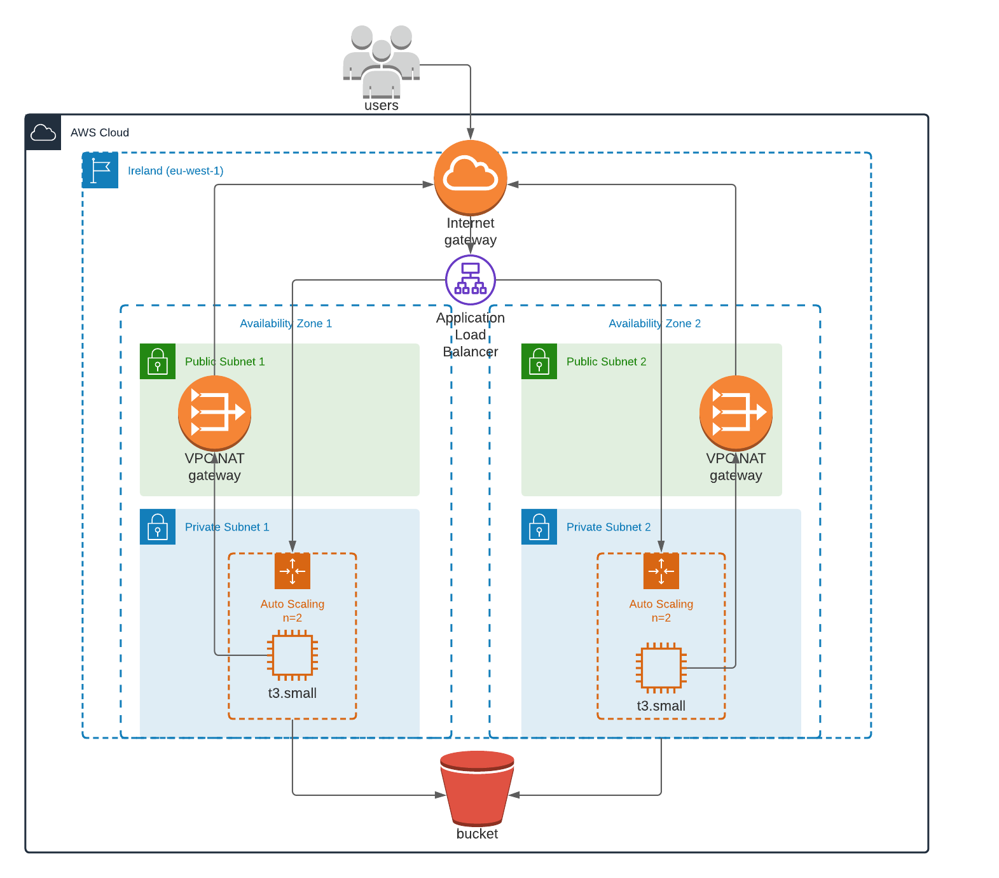

## Cloud Formation Project for high-availability web-app

This repo contains cloud infrastructure for high-availability web-app 
provisioned via cloud formation 
as part of Udacity Cloud DevOps Nanodegree.

## Provisioned Architecture

## Requirements

The code assumes already existing S3 bucket in the account with prepared web-app 
which is then automatically downloaded during each app-server-instance initialization 
and served by Apache HTTP Server.

## Run instructions

create-stack.cmd [stack-name] network-infra/network.yml network-infra/network-parameters.json 
create-stack.cmd [stack-name] ec2-infra/ec2.yml ec2-infra/ec2-parameters.json