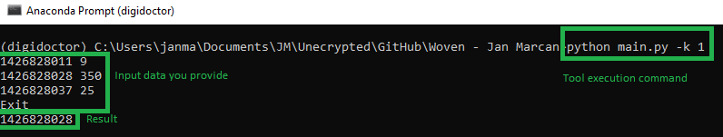
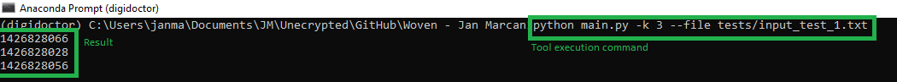
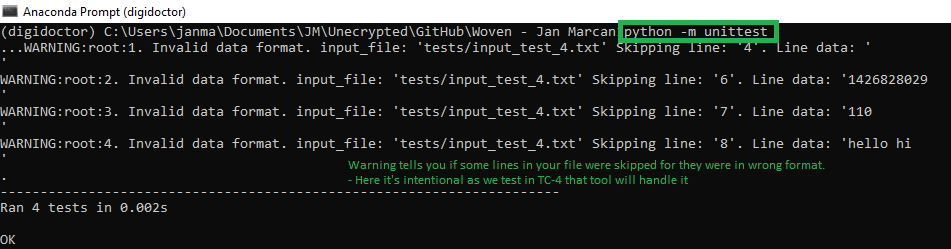

# Data Coding Challenge Statement

Imagine a file in the following fixed format:

<unique record identifier><white_space><numeric value>

e.g.
1426828011 9
1426828028 350
1426828037 25
1426828056 231
1426828058 109
1426828066 111

Write a program that reads from 'stdin' the contents of a file,
and optionally accepts the absolute path of a file from the command line. 
The file/stdin stream is expected to be in the above format. The output should be a list of the unique ids associated
with the X-largest values in the rightmost column, where X is specified by an input
parameter. For example, given the input data above and X=3, the following would be 
valid output:

1426828028
1426828066
1426828056

Note that the output does not need to be in any particular order. Multiple instances
of the same numeric value count as distinct records of the total X. So if we have 4
records with values: 200, 200, 115, 110 and X=2 then the result must consist of the two
IDs that point to 200 and 200 and no more.

Your solution should take into account extremely large files.

Yout task:
1. Code the solution with comments about your solution's algorithmic complexity
for both time and memory.
2. Include instructions on how to build and run your code in a README file.
Please include operating system information if necessary.
3. Provide tests for your code to illustrate it works and it’s robust.

# Accepted solution description

The tool gets record_identifiers of k-largest values either by
- a) processing file
- b) processing stdin

The solution is designed to process even extremely large files 
exceeding the computer RAM.  

## Usage
All commands below are meant to be executed from the main project directory.

### Processing stdin
`python main.py -k <your_input>`
- k represents number of top elements you want to get 

E.g:  
`python main.py -k 1`

P.S. after you execute the command you can start writing your data.
There is no extra message asking you to do so.
This can be changed, but for now I avoided extra prints so it doesn't interfere with integration.

### Processing file
`python main.py -k <your_input> --file <file_path>`
- k represents number of top elements you want to get
- file represents path to the file with data 

E.g.: 
 `python main.py -k 3 --file tests/input_test_1.txt`

### Input data format: 
`<unique record identifier><white_space><numeric value>` 
E.g.: 
- `1426828011 9` 
- `1426828028 350` 
- `1426828037 25`  

Lines that do not conform to the format are ignored. 
The tool notifies you about them by issuing warning messages.

### Tests execution
You trigger tests from the main directory by executing: 
`python -m unittest`

Warning there tells you if some lines in your file were skipped for they were in the wrong format. Here we see it for TC-4 where we test that the tool can handle that. The tool refer you to the lines you can (but don't have to) fix.

## Libraries used
Python 3
- unittest
- argparse
- heapq
- logging

## Main files in the repository
- `main.py`: Main user interface for the tool
- `top_k_elements\top_k_elements.py`: The module to get record identifiers of k-largest values
- `tests\test_top_k_elements.py`: Unit tests