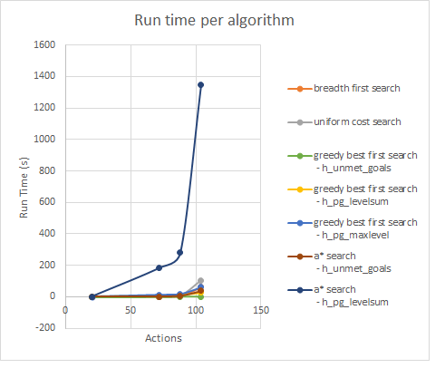

# forward-planning-agent

## Motivation
Planning is an important topic in AI used in robotics, logistics, and self-driving cars.
I did this project as part of Udacity, Artificial Intelligence Nanodegree.

## Project description
This project is split between implementation and analysis. 
First I've combined symbolic logic and classical search to implement an agent that performs a progression search to solve planning problems. 
Then I've experimented with different search algorithms and heuristics, and used the results to answer questions about designing planning systems.

## Results summary

- For a very restricted domain where real-time operation is needed the ideal choice is  Greedy Best First  (h_unmet_goals) that was together with Depth-First between the two fastest algorithms. Greedy Best-First search (heuristics: h_unmet_goals) kept the speed even with increasing numbers of actions and was the fastest algorithm.
- For planning problems where is the most important to find an optimal plan, A* search (heuristics: h_unmet_goals) will deliver an optimal plan while keeping a reasonable run time.

Detailed analysis with data and charts is avaible in report.pdf